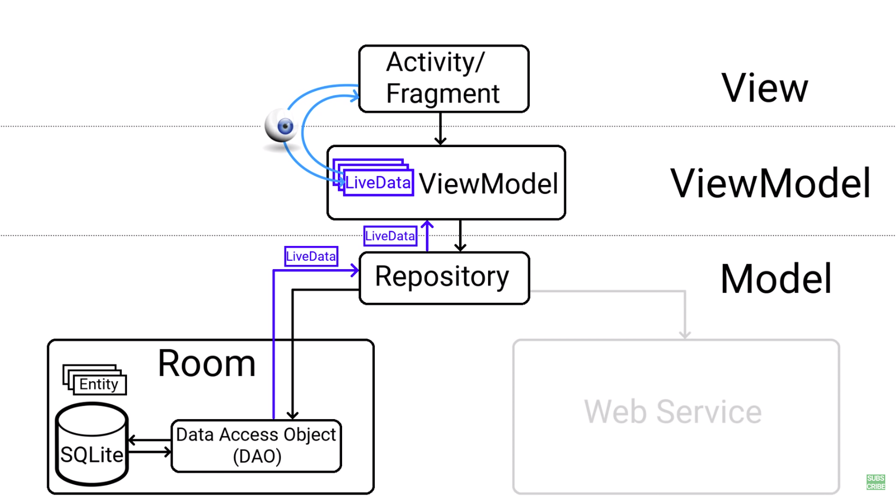
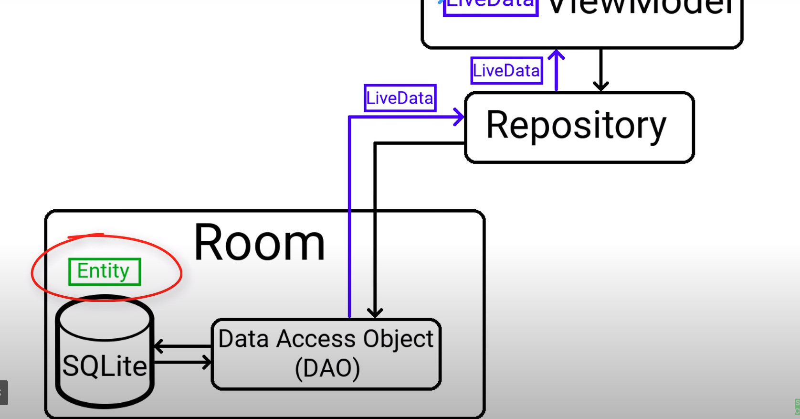
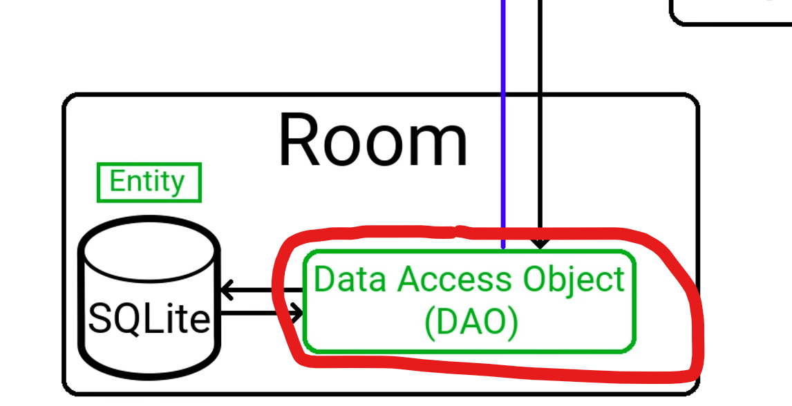
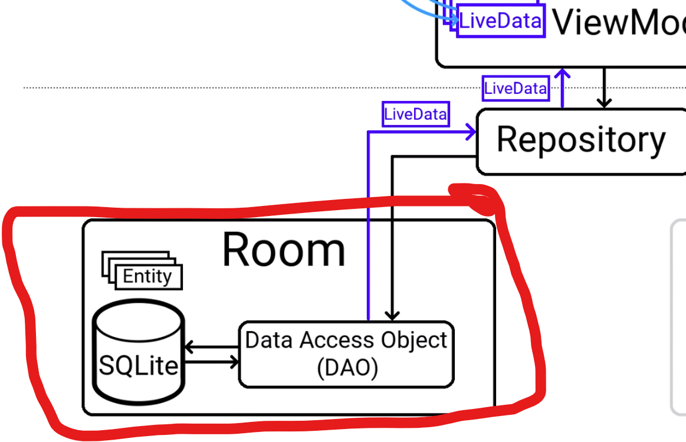
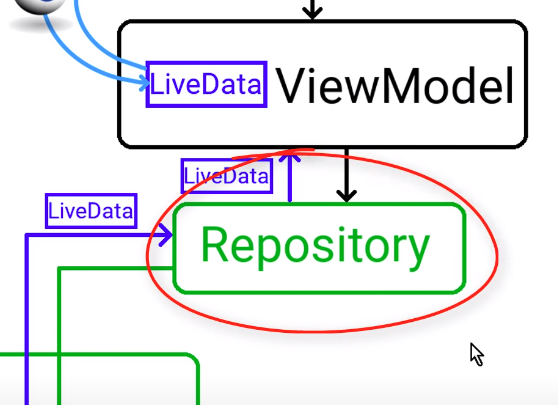
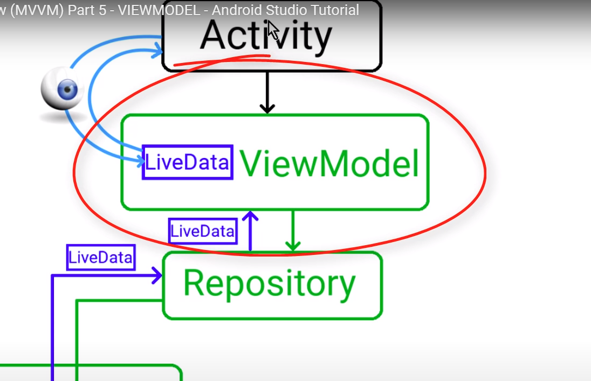

# Android Architechture Components Libraries

Room, ViewModel, LiveData and LifeCycle

> ``CTRL+B`` for access documentation of class

> [Official Android Guide](https://developer.android.com/jetpack/guide)

## Android Studio Project

> Architechture Example

> [Instructions Tutorial](https://codinginflow.com/tutorials/android/room-viewmodel-livedata-recyclerview-mvvm/part-1-introduction)

### Checklist

Follow Video

### Steps

1. Create __Entity__: Java class which relate to one table in our room database.
    
    > In entity class, we can ignore fields by annotating them with ``@Ignore``

1. Create __DAO__(Data Access Object): Defines all the database operations which we want to do on the __Note__ entity.
    
    > Good practice to have one __DAO__ per __Entity__.

1. Create class for __Room__ database itself which will connect all different parts and then create an actual instance of the database
    
    > We will make this class a singleton which means that we can't create multiple instance of this database and instead we use same instance everywhere in the app and can be accesssed by static variable __instance__.

1. Create a __Repository__ class. A simple __Java__ classs. Not in special libraries but is is considered best practice to add abstraction layer between __data sources__ and rest of the app.

1. Add __AsyncTask__ to implement all __noteDao__ methods in __NoteRepository__.

1. For testing purpose, we want to populate database right when we create it. So, create a callback in __NoteDatabase__ called __RoomDatabase.Callback__. Then override __onCreate__ method of database in this callback. Also, create a new __AsyncTask__ for this method. Then add this callback to instance in __getInstance__ function.

1. Create __ViewModel__: Part of Android Architecture Components library. Its job is to store and persist data for user interface and communicate with the model. It requests data from the repository, so the activity or fragment can draw the data on the screen and passes the actions on the screen back to the repository.

    
    > Putting UI data on __ViewModel__ instead of activity or fragment is useful because the state lost by the activity or fragment due to configuration changes e.g. screen rotation, can be persisted in the __ViewModel__.

1. Add reference of __ViewModel__ in activity.
